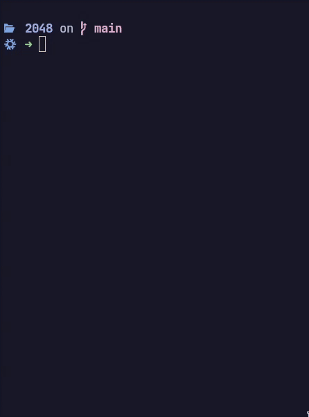

# 2048 Terminal Game

A simple implementation of the classic 2048 game in C, designed to run in the terminal.



## Table of Contents

- [Features](#features)
- [How to Play](#how-to-play)
- [Requirements](#requirements)
- [Build and Run](#build-and-run)
- [Install](#install)
- [Uninstall](#uninstall)
- [Credits](#credits)
- [License](#license)

## Features

- Classic 2048 gameplay in the terminal.
- Responsive arrow key controls.
- Score tracking.
- Ability to undo one move.

## How to Play

The goal of the game is to combine number tiles by moving them in different directions using arrow keys, with the objective of reaching the tile with the value of 2048. When two tiles with the same value collide during a move, they merge into a new tile with the sum of their values. After each move, a new tile (either 2 or 4) will appear in an empty spot on the board. The game continues until there are no empty spots left on the board, and the player can no longer make valid moves, resulting in the game coming to an end.

## Requirements

- GNU Make
- C compiler (GCC or Clang)

## Build and Run

1. Clone the repository:
2. Navigate to the project directory:
    ```bash
    git clone https://github.com/Frost-Phoenix/2048-cli.git
    cd 2048-terminal-game
    ```
3. Build then run the game:
    ```bash
    make
    ./bin/2048
    ```
 - Or build and run with:

    ```bash
    make run
    ```
5. Use arrow keys to play, and enjoy the game!

## Install

To install the game and make it available system-wide, use the following commands:

```bash
sudo make install
```
The game will be installed in the default location (/usr/local/bin). If you wish to install it in a different location, modify the INSTALL_DIR variable in the Makefile before running the install command.

## Uninstall

To uninstall the game, use the following command:

```bash
sudo make uninstall
```
This will remove the game executable and header files if they were installed.

## Credits

This project is inspired by and incorporates ideas from the following project:

- [mevdschee/2048.c](https://github.com/mevdschee/2048.c)
- [alewmoose/2048-in-terminal](https://github.com/alewmoose/2048-in-terminal)


## License

This project is licensed under the MIT License - see the [LICENSE](LICENSE) file for details.
